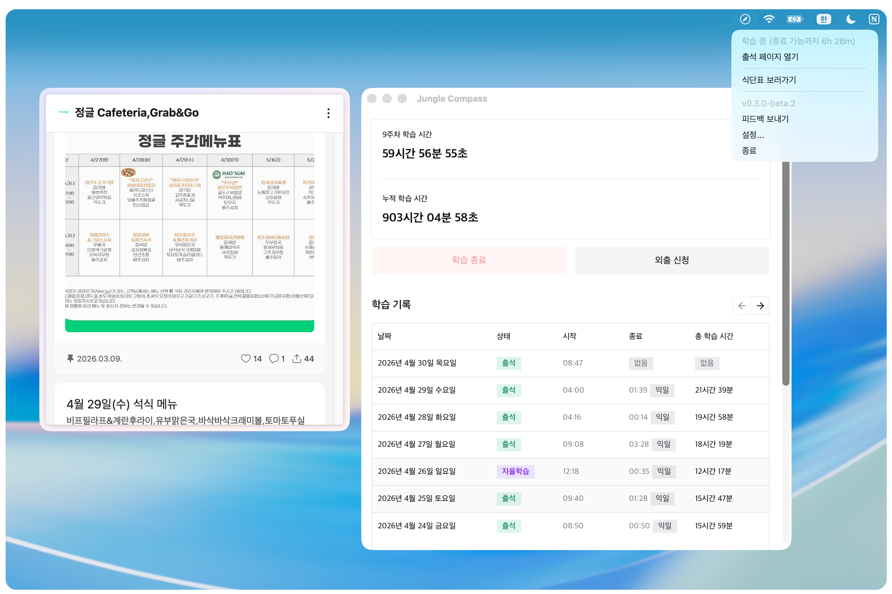
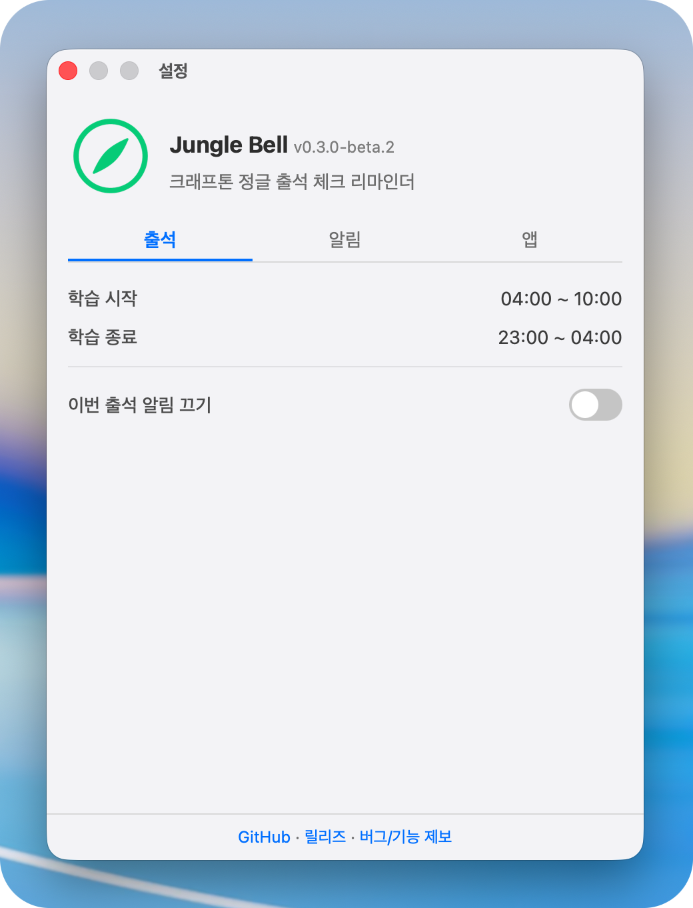
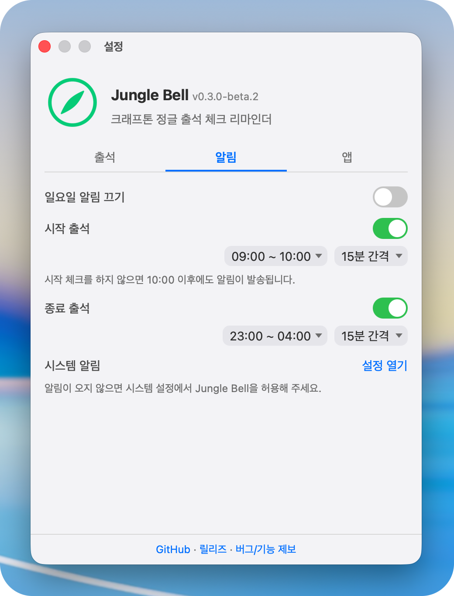
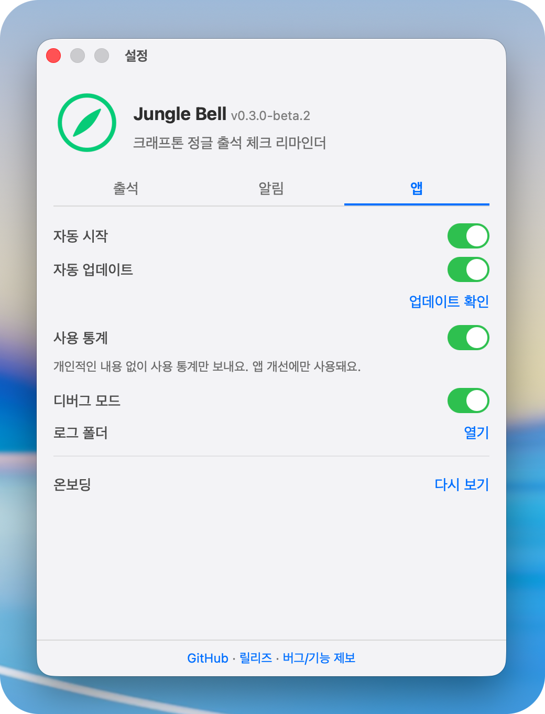

<p></p>


<div>
<h3>Jungle Bell</h3>
<p>크래프톤 정글 출석 상태를 메뉴 바와 작업 표시줄에서 확인해요.<br>출석이 필요할 때 알림을 받고, 아이콘 색으로 현재 상태를 볼 수 있어요.</p>
</div>

<hr>

<div align="center">
    <a href="https://github.com/YangSiJun528/jungle-bell/releases">
        
    </a>
    <a href="LICENSE">
        
    </a>
    <a href="https://github.com/YangSiJun528/jungle-bell/actions/workflows/release.yml">
        
    </a>
    
</div>

<br/>

> [!CAUTION]  
> Jungle Bell은 크래프톤 정글 공식 앱이 아니며, 자동 출석 기능을 제공하지 않습니다.

<p align="center">
  
</p>

## 설치

아래 명령어를 실행해 Jungle Bell을 설치하세요.  
수동 설치를 원하는 경우 [Release 페이지](https://github.com/YangSiJun528/jungle-bell/releases/latest)의 안내를 참고하세요.

### macOS

```bash
curl -fsSL https://install.sijun-yang.com/jungle-bell.sh | sh
```

### Windows

```powershell
irm https://install.sijun-yang.com/jungle-bell.ps1 | iex
```

## 스크린샷

<p align="center">
  
  
  
  
  
</p>

## 출석 상태 보기

출석 상태는 메뉴 바(macOS) 또는 작업 표시줄(Windows)에 있는 Jungle Bell 아이콘 색으로 표시돼요.

<table>
  <tr>
    <td align="center" bgcolor="#111111" width="52">
      
    </td>
    <td><strong>출석 시작/종료 가능</strong><br>출석 페이지를 열어 체크인/체크아웃해 주세요.</td>
  </tr>
  <tr>
    <td align="center" bgcolor="#111111" width="52">
      
    </td>
    <td><strong>학습 중 / 출석 완료</strong><br>출석이 완료된 상태에요.</td>
  </tr>
  <tr>
    <td align="center" bgcolor="#111111" width="52">
      
    </td>
    <td><strong>로그인 필요</strong><br>Jungle Campus에 로그인해 주세요.</td>
  </tr>
</table>

## 처음 실행 시

1. 앱을 실행하고 온보딩 안내를 확인하세요.
2. 온보딩에서 **출석 페이지 열기** 를 눌러 Jungle Campus에 로그인하세요.
3. 메뉴 바(macOS) 또는 작업 표시줄(Windows)의 Jungle Bell 아이콘 색으로 출석 상태를 확인하세요.
4. 아이콘을 클릭해 출석 페이지 열기, 설정 같은 기능을 사용할 수 있어요.

## 문제가 생겼나요?

#### 아이콘이 안 보여요.

macOS는 메뉴 바 오른쪽을 확인해 주세요.

Windows는 작업 표시줄 오른쪽을 확인해 주세요. 처음에는 숨겨진 아이콘 메뉴(`∧`)에 있을 수 있어요.

#### 로그인이 필요하다고 떠요.

Jungle Bell 안에서 **출석 페이지 열기** 를 눌러 Jungle Campus에 로그인해 주세요.

#### 알림이 오지 않아요.

설정의 알림 탭에서 필요한 알림이 켜져 있는지 확인해 주세요.

알림을 꺼도 메뉴 바나 작업 표시줄의 Jungle Bell 아이콘 색으로 상태를 볼 수 있어요.

#### 설치 중 경고가 떠요.

자동 설치 명령을 사용하는 것을 권장합니다.  
직접 다운로드 방법과 문제 해결은 [Release 페이지](https://github.com/YangSiJun528/jungle-bell/releases/latest)의 안내를 확인해 주세요.

#### 출석 상태가 실제와 달라요.

**출석 페이지 열기** 를 눌러 로그인 상태를 다시 확인해 주세요. 계속 다르면 [문의](#문의하기)해 주세요.

## 문의하기

버그나 사용 중 막힌 부분은 아래 경로로 알려주세요.

- [GitHub Issue](https://github.com/YangSiJun528/jungle-bell/issues/new/choose)
- [크래프톤 정글 Slack](https://krafton-aliens.slack.com/team/U0AHGCT20DQ)
- [이메일](mailto:yangsijun5528@gmail.com)

문의할 때 사용 중인 OS, 재현 조건, 가능하면 스크린샷을 함께 보내주시면 좋아요.

## 주의사항

#### 비공식 앱

Jungle Bell은 크래프톤 정글 공식 앱이 아닙니다.  
SW-AI Lab 12기인 한 정글러가 관리하는 비공식 앱입니다.

#### 자동 출석 미지원

자동 출석 기능은 제공하지 않으며, 앞으로도 제공할 계획이 없습니다.  
출석은 Jungle Campus 출석 페이지에서 직접 진행해야 합니다.

#### 문의

기능 관련 버그나 문의는 [이슈](https://github.com/YangSiJun528/jungle-bell/issues)를 통해 제보해 주세요.

## 라이선스

[Apache License 2.0](LICENSE)
