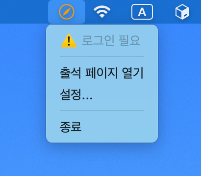
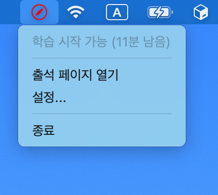
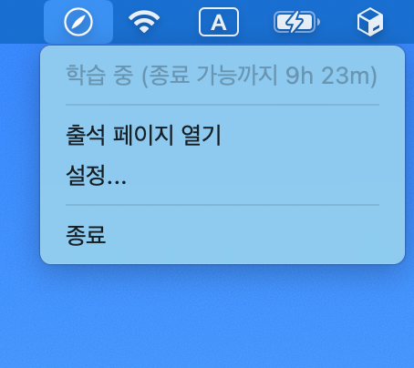

<p></p>


<div>
<h3>Jungle Bell</h3>
<p>크래프톤 정글 출석 체크 리마인더.<br>시스템 트레이에서 출석 상태를 실시간으로 확인할 수 있으며, 학습 시작/종료가 필요할 때 아이콘 색상과 알림으로 알려줍니다.</p>
</div>

<hr>

[](https://github.com/YangSiJun528/jungle-bell/releases)
[](LICENSE)
[](https://github.com/YangSiJun528/jungle-bell/actions/workflows/release.yml)
[]()
[](https://github.com/YangSiJun528/jungle-bell)

<br/>

> [!CAUTION]     
> 1. **이 앱은 크래프톤 정글의 공식 앱이 아닙니다.**    
> SW-AI Lab 12기인 한 정글러가 관리하는 비공식 앱입니다.    
> 기능 관련 버그나 문의는 [이슈](https://github.com/YangSiJun528/jungle-bell/issues)를 통해 제보해 주세요.   
> 2. **자동 출석 기능은 제공하지 않으며, 앞으로도 제공할 계획이 없습니다.**   
> 자동화된 방식으로 출석을 처리하는 행위는 불이익을 받을 수 있습니다.   
> 제작자는 이러한 사용을 지원하거나 권장하지 않습니다.  

## 데모
<p align="center">
    
</p>

## 주요 기능

- **출석 상태 실시간 확인** — 트레이 아이콘 색상으로 현재 상태를 한눈에 확인
- **출석 알림** — 출석이 필요한 시간대에 시스템 알림으로 반복 알림 (시간대, 간격 설정 가능)
- **시작 시 자동 실행** — 컴퓨터를 켜면 앱이 자동으로 실행

## 상태 표시

| 상태 | 아이콘                                                            | 설명 |
|------|----------------------------------------------------------------|------|
| 로그인 필요 |    | 로그인이 필요할 때 오렌지색으로 표시됩니다. |
| 출석 필요 |  | 학습 시작 또는 종료가 필요할 때 빨간색으로 표시됩니다. |
| 학습 중 |      | 정상적으로 학습 중일 때 흰색으로 표시됩니다. |

## 트레이 메뉴


| 항목 | 설명 |
|-----|------|
| 현재 상태 | 현재 출석 상태와 다음 액션까지의 남은 시간을 표시합니다. |
| 출석 페이지 열기 | 출석 페이지를 앱 내부 브라우저로 엽니다. 이 창을 통해 로그인해야 출석 상태를 확인할 수 있습니다. |
| 설정 | 앱 설정을 엽니다. |
| 종료 | 앱을 종료합니다. |

## 설치

한 줄로 최신 버전을 설치할 수 있습니다. 특정 버전이나 수동 설치는 [수동 다운로드](#수동-다운로드)를 참고하세요.

### macOS

```bash
curl -fsSL https://install.sijun-yang.com/jungle-bell.sh | sh
```

### Windows

```powershell
irm https://install.sijun-yang.com/jungle-bell.ps1 | iex
```

### 수동 다운로드

특정 버전이 필요하거나 자동 설치가 어려운 환경이라면 [Releases](https://github.com/YangSiJun528/jungle-bell/releases)에서 직접 받을 수 있습니다.

| 파일명 | 대상                            |
|--------|-------------------------------|
| `Jungle Bell_x.x.x_aarch64.dmg` | macOS (Apple Silicon) — M 시리즈 |
| `Jungle Bell_x.x.x_x64.dmg` | macOS (Intel)                 |
| `Jungle Bell_x.x.x_x64-setup.exe` | Windows                       |

모델을 모르겠다면 Mac에서 왼쪽 상단  → **이 Mac에 관하여**에서 확인할 수 있습니다.

#### macOS 수동 설치

> [!WARNING]    
> Jungle Bell은 Apple 공인 인증서로 서명되지 않은 앱입니다.     
> `.dmg`로 직접 설치하면 macOS 첫 실행 시 **"손상되었기 때문에 열 수 없습니다"** 오류가 표시됩니다.     
> 아래 명령으로 격리 속성을 제거하면 실행할 수 있습니다. (자동 설치 스크립트는 이 과정을 대신 수행합니다.)
>   
> ~~Apple Developer Program 비용이 $99라 너무 비싸요. 😭~~

`.dmg` 파일을 다운로드한 후, 클릭하여 Applications 폴더에 설치해주세요.

이후 다음 명령어를 실행하면 문제없이 실행이 가능합니다.

```bash
xattr -cr "/Applications/Jungle Bell.app"
```

#### Windows 수동 설치

`-setup.exe` 파일을 다운로드하여 실행하세요.

"Windows의 PC 보호" 경고가 표시되면 **추가 정보** → **실행** 을 클릭하면 됩니다.

## 처음 실행 시

1. 앱을 실행하면 메뉴 막대(macOS) 또는 시스템 트레이(Windows)에 아이콘이 나타납니다.
2. 아이콘을 클릭해 **출석 페이지 열기** 를 선택하세요.
3. 열린 창에서 **Jungle Campus에 로그인** 하세요. 로그인 이후부터 출석 상태를 자동으로 불러옵니다.

## FAQ

**Q. 트레이 아이콘 색상이 바뀌지 않아요.**

앱은 주기적으로 출석 상태를 확인합니다. 최초 실행 후 상태를 불러오는 데 수 초가 걸릴 수 있으며, 이후에는 상태에 따라 최대 2분 간격으로 갱신됩니다. 잠시 기다린 후 변경 여부를 확인해 주세요.

아이콘이 오렌지색이라면 Jungle Campus 로그인이 필요한 상태입니다. **출석 페이지 열기** 를 통해 로그인하면 상태가 갱신됩니다.

**Q. 알림이 오지 않아요.**

설정 > 알림 탭에서 알림이 켜져 있는지 확인해 주세요. 또한 운영체제의 알림 설정에서 Jungle Bell의 알림이 허용되어 있어야 합니다. **알림 설정 열기** 버튼으로 바로 이동할 수 있습니다.

**Q. macOS에서 "손상되었기 때문에 열 수 없습니다" 오류가 떠요.**

자동 설치 스크립트(`curl ... | sh`)를 사용했다면 발생하지 않습니다. `.dmg`로 수동 설치한 경우 [macOS 수동 설치](#macos-수동-설치) 의 `xattr` 명령을 실행해 주세요.

**Q. Windows에서 "Windows의 PC 보호" 경고가 떠요.**

[Windows 설치 방법](#windows) 을 참고하세요.

**Q. 출석 상태가 실제와 다르게 표시돼요.**

앱 내부의 **출석 페이지 열기** 창을 통해 Jungle Campus에 로그인된 상태여야 합니다. 외부 브라우저에서의 로그인 상태는 앱과 공유되지 않습니다.

## 라이선스

[Apache License 2.0](LICENSE)

## 문의 시 함께 보내 주세요

버그 이슈나 사용 중 문의를 남길 때 로그 파일을 함께 보내주시면 문제 해결에 도움이 됩니다.

설정 > 정보 탭에서 **로그 폴더 열기** 버튼으로 바로 열 수 있습니다.

- macOS: `~/Library/Logs/dev.sijun-yang.jungle-bell/`
- Windows: `%APPDATA%\dev.sijun-yang.jungle-bell\logs\`
