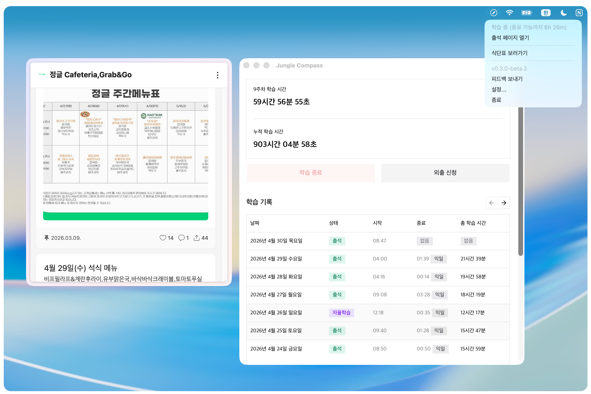
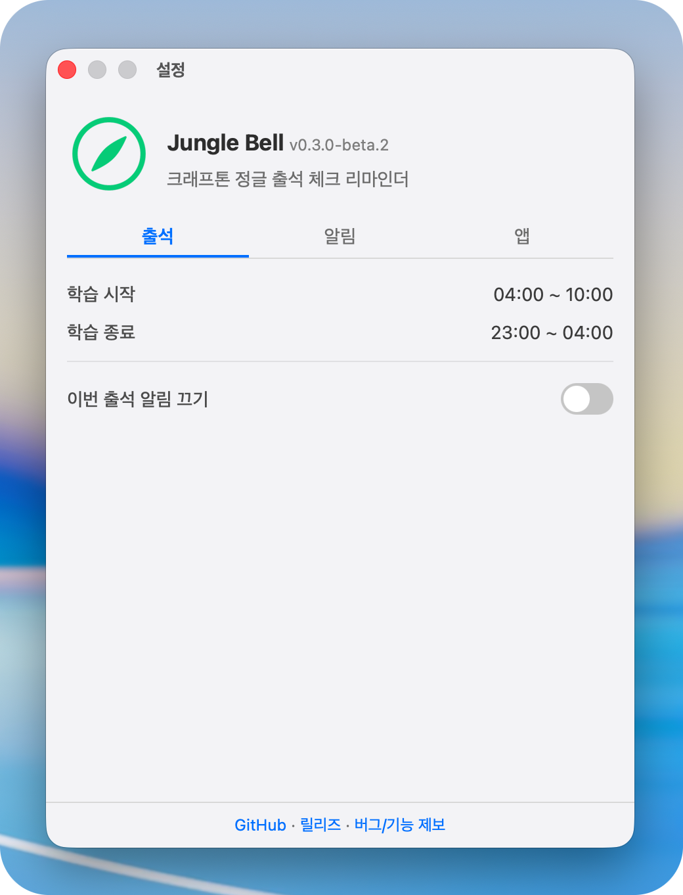
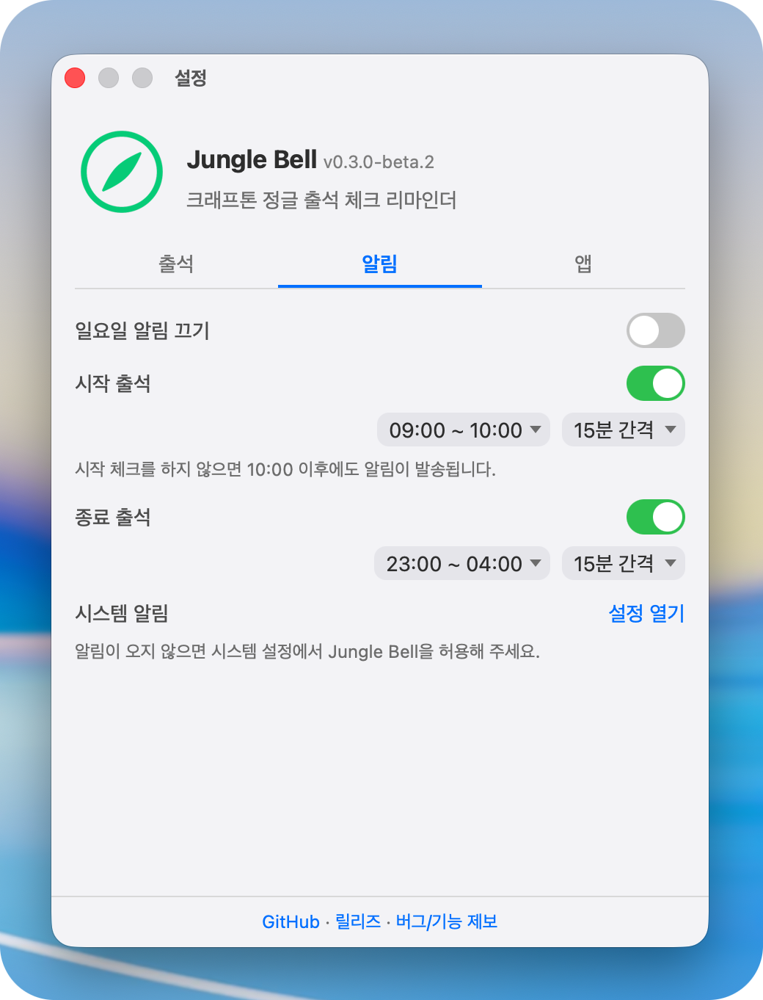
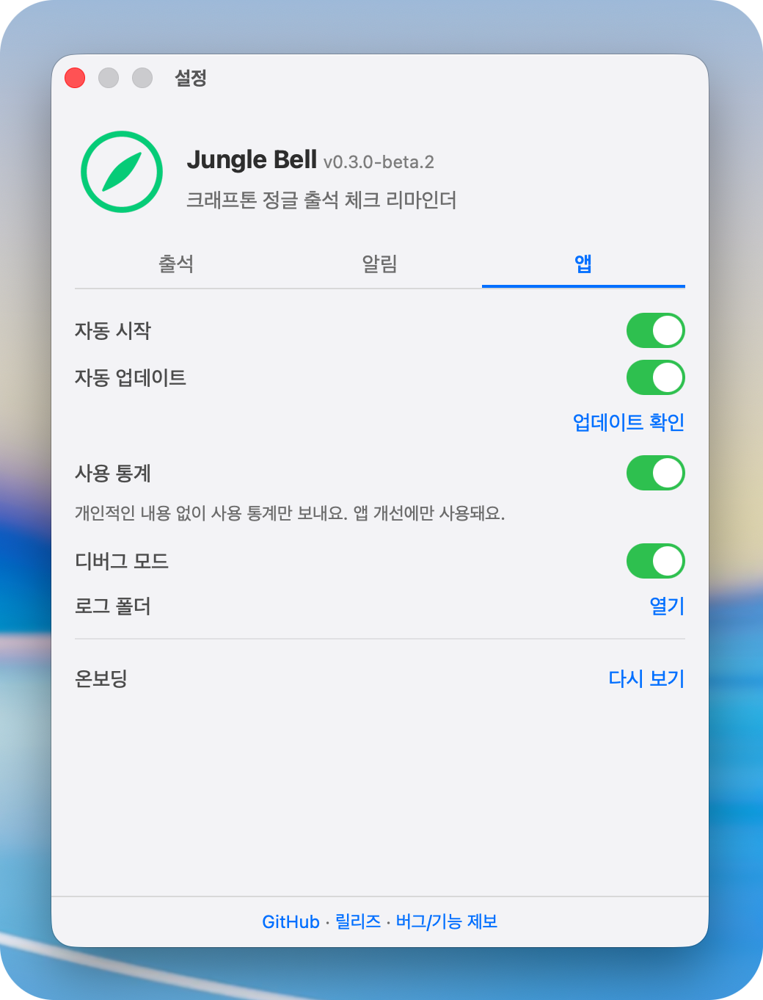

<p></p>


<div>
<h3>Jungle Bell</h3>
<p>크래프톤 정글 출석 상태를 메뉴 바와 작업 표시줄에서 바로 확인해요.<br>출석 알림과 함께 워시타워 현황, 오늘의 식단도 한곳에서 볼 수 있어요.</p>
</div>

<br/>

<div align="center">
    <a href="https://github.com/YangSiJun528/jungle-bell/releases"></a>
    <a href="LICENSE"></a>
    <a href="https://github.com/YangSiJun528/jungle-bell"></a>
    <br/>
    
</div>

<hr>

> [!CAUTION]  
> Jungle Bell은 크래프톤 정글 공식 앱이 아니며, 자동 출석 기능을 제공하지 않습니다.

## 설치

수동 설치를 원하는 경우 [Release 페이지](https://github.com/YangSiJun528/jungle-bell/releases/latest)를 참고하세요.

### macOS

아래 명령어를 터미널에서 실행해 Jungle Bell을 설치하세요.

```bash
curl -fsSL https://install.sijun-yang.com/jungle-bell.sh/latest | sh
```

### Windows

아래 명령어를 PowerShell에서 실행해 Jungle Bell을 설치하세요.

```powershell
irm https://install.sijun-yang.com/jungle-bell.ps1/latest | iex
```

### AI 에이전트에게 맡기기

Codex나 Claude Code처럼 컴퓨터 명령을 대신 실행할 수 있는 AI 에이전트에게 아래 문장을 보내세요.

```text
이 컴퓨터에 Jungle Bell 최신 안정 릴리스를 설치해 줘: https://github.com/YangSiJun528/jungle-bell
README의 설치 섹션에서 운영체제에 맞는 자동 설치 명령을 사용해.
```

> 에이전트 환경에 따라 명령 실행과 다운로드 권한을 직접 승인해야 할 수 있어요.

## 스크린샷

<p align="center">
  
  
  
  
  
</p>

## 출석 상태 보기

출석 상태는 메뉴 바(macOS) 또는 작업 표시줄(Windows)에 있는 Jungle Bell 아이콘으로 표시돼요. 확인이나 조작이 필요할 때만 상태색을 사용하고, 그 외에는 운영체제 테마에 맞는 무채색 컷아웃으로 표시됩니다.

<table>
  <tr>
    <td align="center" width="58">
      
    </td>
    <td><strong>상태 확인 중 / 확인 불가</strong><br>로그인 세션이나 네트워크 상태를 다시 확인하고 있어요.</td>
  </tr>
  <tr>
    <td align="center" width="58">
      
    </td>
    <td><strong>출석 시작/종료 가능</strong><br>출석 페이지를 열어 체크인/체크아웃해 주세요.</td>
  </tr>
  <tr>
    <td align="center" width="58">
      
    </td>
    <td><strong>학습 중 / 별도 조작 없음</strong><br>현재 출석이 정상적으로 진행 중이며 지금 처리할 작업은 없어요.</td>
  </tr>
  <tr>
    <td align="center" width="58">
      
    </td>
    <td><strong>출석 완료</strong><br>나침반은 투명하게 뚫리고, 밝은 배경에서는 흰색, 어두운 배경에서는 검정으로 낮게 표시돼요.</td>
  </tr>
  <tr>
    <td align="center" width="58">
      
    </td>
    <td><strong>로그인 필요</strong><br>Jungle Campus에 로그인해 주세요.</td>
  </tr>
</table>

## 처음 실행 시

1. 앱을 실행하고 온보딩 안내를 확인하세요.
2. 온보딩에서 **출석 페이지 열기** 를 눌러 Jungle Campus에 로그인하세요.
3. 메뉴 바(macOS) 또는 작업 표시줄(Windows)의 Jungle Bell 아이콘 색으로 출석 상태를 확인하세요.
4. 아이콘을 클릭해 출석 페이지, 워시타워 현황, 오늘의 식단, 설정을 열 수 있어요.

## 생활 정보 보기

트레이 메뉴의 **워시타워 현황**에서는 세탁기와 건조기의 사용 가능 여부, 남은 시간, 예상 종료 시각을 확인할 수 있습니다. `추정` 표시는 마지막 LG ThinQ 관측값을 기준으로 계산한 값이며, 0분이 되어도 완료 상태가 확인되기 전에는 **완료 확인 중**으로 표시됩니다.

**오늘의 식단**에서는 당일 중식과 석식, 고정된 주간 식단표, 최근 식단을 확인할 수 있습니다. 네트워크나 수집이 일시적으로 실패하면 앱에 마지막으로 저장된 정보를 표시합니다.

## 문제가 생겼나요?

#### 아이콘이 안 보여요.

macOS는 메뉴 바 오른쪽을 확인해 주세요.

Windows는 작업 표시줄 오른쪽을 확인해 주세요. 처음에는 숨겨진 아이콘 메뉴(`∧`)에 있을 수 있어요.

#### 로그인이 필요하다고 떠요.

Jungle Bell 안에서 **출석 페이지 열기** 를 눌러 Jungle Campus에 로그인해 주세요.

#### 알림이 오지 않아요.

설정의 알림 탭에서 필요한 알림이 켜져 있는지 확인해 주세요.

알림을 꺼도 메뉴 바나 작업 표시줄의 Jungle Bell 아이콘 색으로 상태를 볼 수 있어요.

#### 설치 중 경고가 떠요.

자동 설치 명령을 사용하는 것을 권장합니다.  
직접 다운로드 방법과 문제 해결은 [Release 페이지](https://github.com/YangSiJun528/jungle-bell/releases/latest)의 안내를 확인해 주세요.

#### 출석 상태가 실제와 달라요.

**출석 페이지 열기** 를 눌러 로그인 상태를 다시 확인해 주세요. 계속 다르면 [문의](#문의하기)해 주세요.

## 질문·제보하기

- GitHub Discussions: [공지](https://github.com/YangSiJun528/jungle-bell/discussions/categories/공지), [건의하기](https://github.com/YangSiJun528/jungle-bell/discussions/categories/건의하기), [궁금해요](https://github.com/YangSiJun528/jungle-bell/discussions/categories/궁금해요)
- [GitHub Issues](https://github.com/YangSiJun528/jungle-bell/issues/new?template=bug.yml): 재현 가능한 버그 제보

버그를 제보할 때는 사용 중인 OS, 재현 조건, 가능하면 스크린샷을 함께 보내주시면 좋아요.
공개하기 어려운 문의는 앱 설정의 **문의**에서 Slack이나 이메일을 이용해 주세요.

## 주의사항

#### 비공식 앱

Jungle Bell은 크래프톤 정글 공식 앱이 아닙니다.  
SW-AI Lab 12기인 한 정글러가 관리하는 비공식 앱입니다.

#### 자동 출석 미지원

자동 출석 기능은 제공하지 않으며, 앞으로도 제공할 계획이 없습니다.  
출석은 Jungle Campus 출석 페이지에서 직접 진행해야 합니다.

#### 문의

새 기능·보완 요청은 Discussions의 **건의하기**에, 그 외 내용은 **궁금해요**에 남겨 주세요. 재현 가능한 버그 제보만 [버그 양식](https://github.com/YangSiJun528/jungle-bell/issues/new?template=bug.yml)을 사용합니다.

## 라이선스

[Apache License 2.0](LICENSE)
