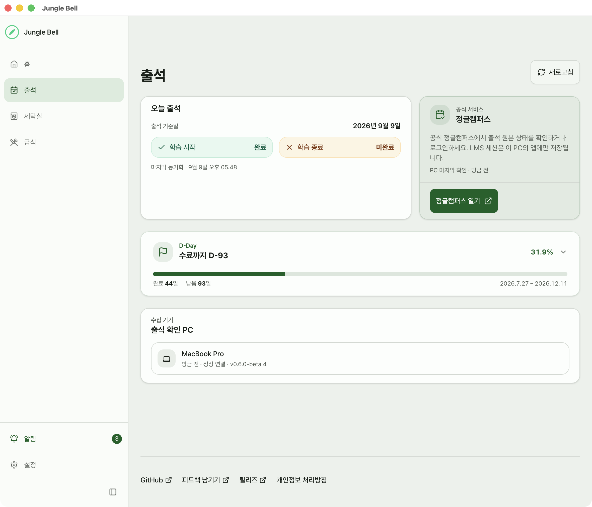
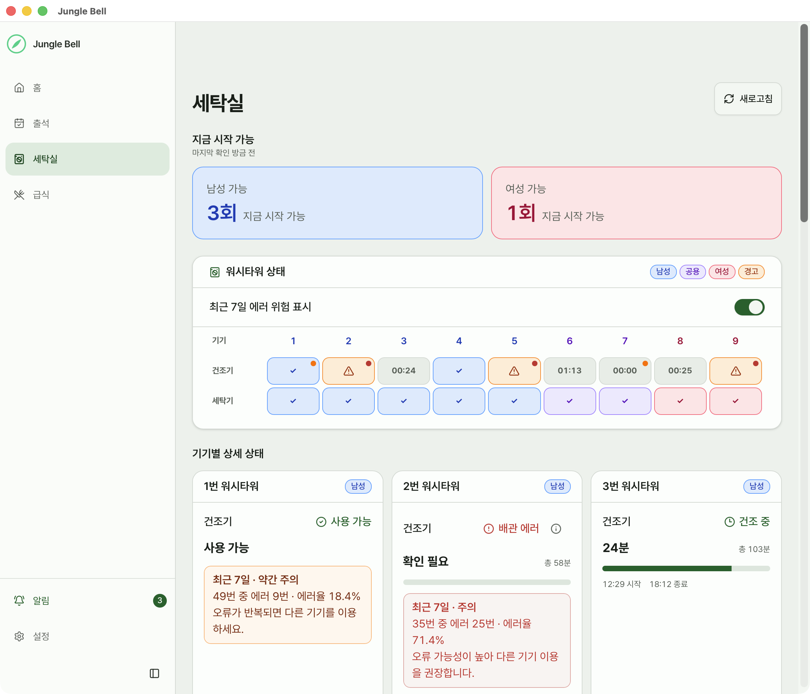
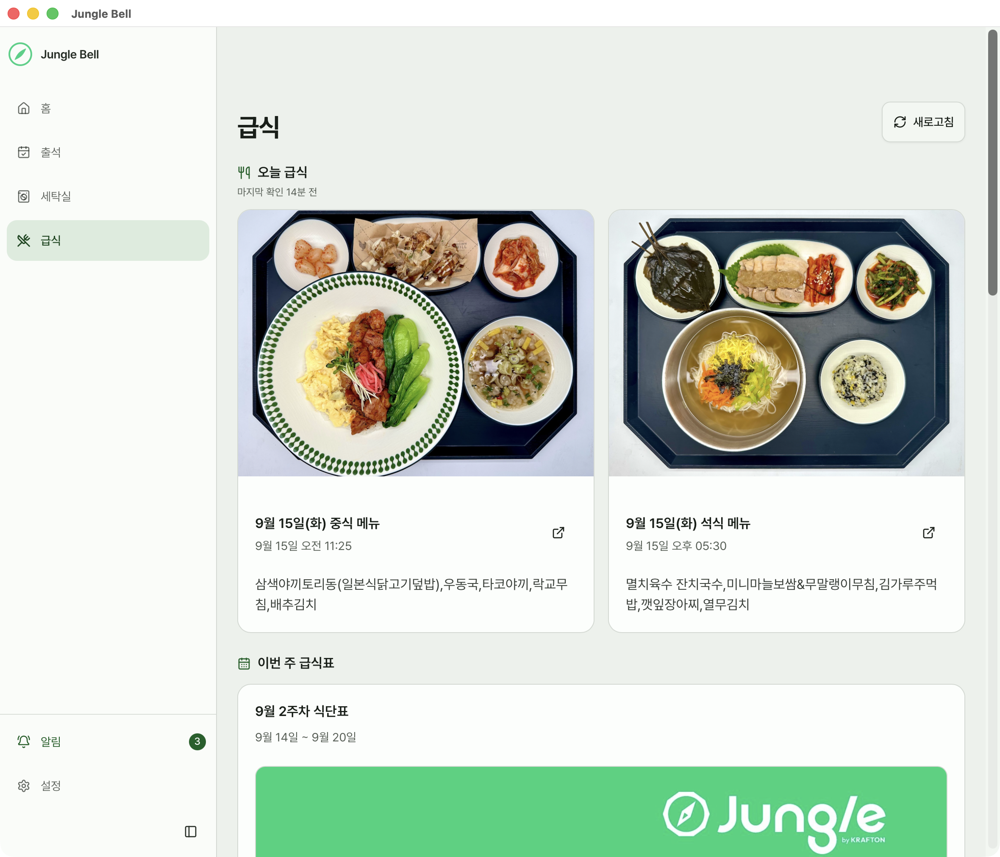
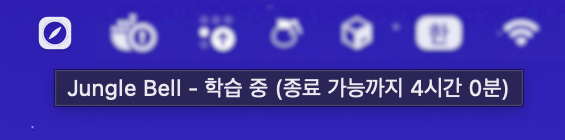
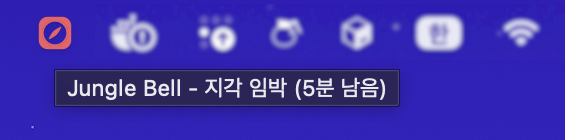
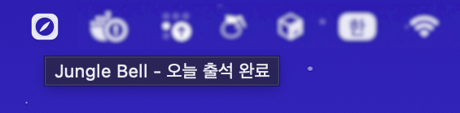
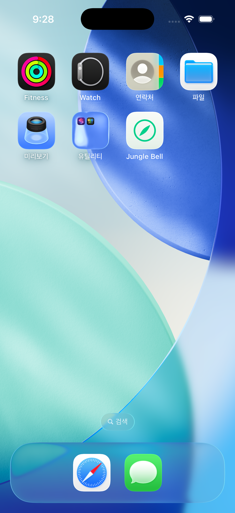
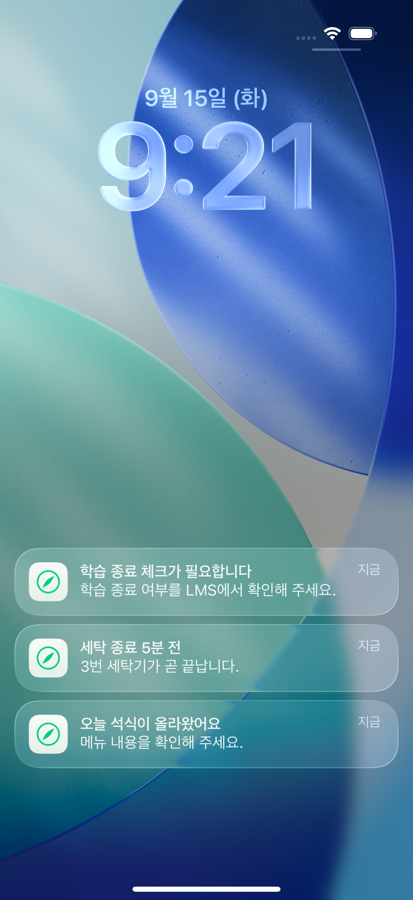
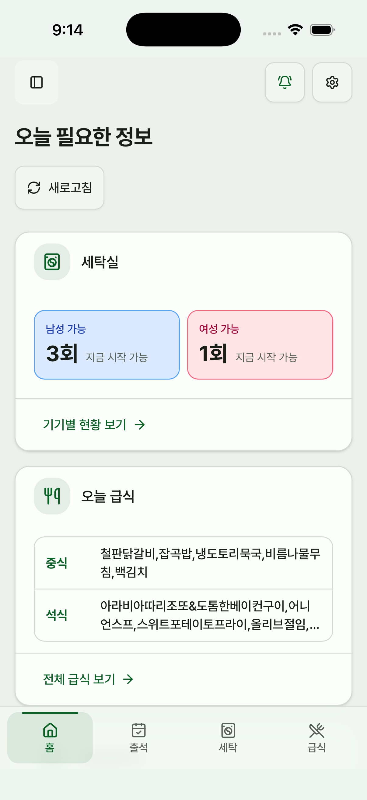
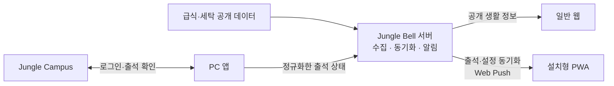

<p align="center">
  
</p>

<h1 align="center">Jungle Bell</h1>

<p align="center">
  크래프톤 정글의 생활 정보를 어디서나 편하게 확인하세요.
</p>

<div align="center">
  <a href="https://github.com/YangSiJun528/jungle-bell/releases"></a>
  <a href="LICENSE"></a>
  <a href="https://github.com/YangSiJun528/jungle-bell"></a>
</div>

## 주요 기능

- **출석:** PC 앱이 Jungle Campus 출석 상태를 확인하고 PC와 연결된 PWA 앱에 동기화합니다.
- **세탁실:** 세탁기·건조기의 사용 가능 여부, 남은 시간과 예상 종료 시각을 확인합니다.
- **식단:** 오늘의 중식·석식, 이번 주 식단표와 최근 식단 기록을 확인합니다.
- **알림:** 출석 시간대·식사 시간·세탁 종료 또는 사용 가능 시점에 맞춰 알려 주어 필요한 확인을 놓치지 않게 합니다.

## 실제 화면

<table width="100%">
  <tr>
    <th width="33%" align="center">출석</th>
    <th width="33%" align="center">세탁실</th>
    <th width="33%" align="center">급식</th>
  </tr>
  <tr>
    <td align="center">
      <a href="docs/assets/readme/desktop-attendance.png"></a>
    </td>
    <td align="center">
      <a href="docs/assets/readme/desktop-laundry.png"></a>
    </td>
    <td align="center">
      <a href="docs/assets/readme/desktop-meals.png"></a>
    </td>
  </tr>
</table>

### 트레이 상태 변화

<table>
  <tr>
    <td width="33%" align="center">
      <a href="docs/assets/readme/desktop-tray-studying.png"></a>
    </td>
    <td width="33%" align="center">
      <a href="docs/assets/readme/desktop-tray-warning.png"></a>
    </td>
    <td width="33%" align="center">
      <a href="docs/assets/readme/desktop-tray-complete.png"></a>
    </td>
  </tr>
</table>

### PWA 앱 화면

<table width="100%">
  <tr>
    <td width="33%" align="center">
      <a href="docs/assets/readme/ios-home-screen.webp"></a>
    </td>
    <td width="33%" align="center">
      <a href="docs/assets/readme/ios-notifications.webp"></a>
    </td>
    <td width="33%" align="center">
      <a href="docs/assets/readme/ios-home.png"></a>
    </td>
  </tr>
</table>

## 설치

각 운영체제에 맞는 명령어를 수행해 주세요.

만약 PC 앱 수동 설치를 원하는 경우 [최신 Release](https://github.com/YangSiJun528/jungle-bell/releases/latest)를 확인하세요.

### macOS

아래 명령어를 터미널에서 실행해 Jungle Bell을 설치하세요.

```bash
curl -fsSL https://install.sijun-yang.com/jungle-bell.sh/latest | sh
```

### Windows

아래 명령어를 PowerShell에서 실행해 Jungle Bell을 설치하세요.

```powershell
irm https://install.sijun-yang.com/jungle-bell.ps1/latest | iex
```

### 웹/PWA

웹·PWA는 [jungle-bell.sijun-yang.com](https://jungle-bell.sijun-yang.com/)에서 바로 사용할 수 있습니다.

일반 웹에서는 세탁·급식 정보를 확인할 수 있으며, 출석·알림 기능은 제공하지 않습니다. 출석·알림은 PWA를 설치하고 PC 앱과 연결하면 사용할 수 있습니다.

## 동작 방식


```mermaid
flowchart LR
    Campus["Jungle Campus"] <-->|"로그인·출석 확인"| PC["PC 앱"]
    Sources["급식·세탁 공개 데이터"] --> Server["Jungle Bell 서버<br/>수집 · 동기화 · 알림"]
    PC -->|"정규화한 출석 상태"| Server
    Server -->|"공개 생활 정보"| Web["일반 웹"]
    Server -->|"출석·설정 동기화<br/>Web Push"| PWA["설치형 PWA"]
```

- PC 앱은 Jungle Campus에서 출석 상태를 확인해 서버와 동기화합니다.
- 일반 웹은 로그인 없이 공개 급식·세탁 정보를 조회합니다.
- 설치형 PWA는 연결된 PC가 동기화한 출석 상태와 개인 알림을 받습니다.
- PC 앱이 종료되거나 컴퓨터가 잠자기 상태면 출석 정보가 갱신되지 않습니다.

## 피드백 주기

> [!CAUTION]
> Jungle Bell은 크래프톤 정글 공식 앱이 아니며 자동 출석 기능을 제공하지 않습니다.

[버그 제보](https://github.com/YangSiJun528/jungle-bell/issues/new?template=bug.yml) · [기능 개선](https://github.com/YangSiJun528/jungle-bell/issues/new?template=feature_request.yml) · [질문](https://github.com/YangSiJun528/jungle-bell/issues/new?template=question.yml)

## 기여하기

[기여 안내](CONTRIBUTING.md)를 확인해 주세요.

## 개인정보 처리방침

[웹에서 확인하기](https://jungle-bell.sijun-yang.com/#/privacy)

## 라이선스

[Apache License 2.0](LICENSE)
