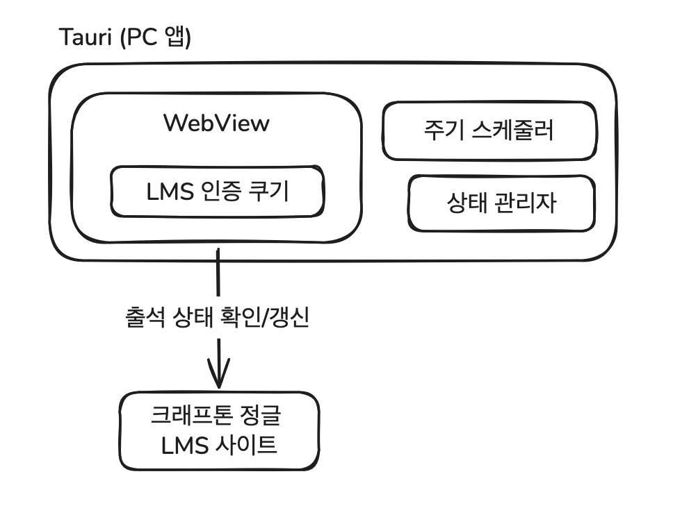
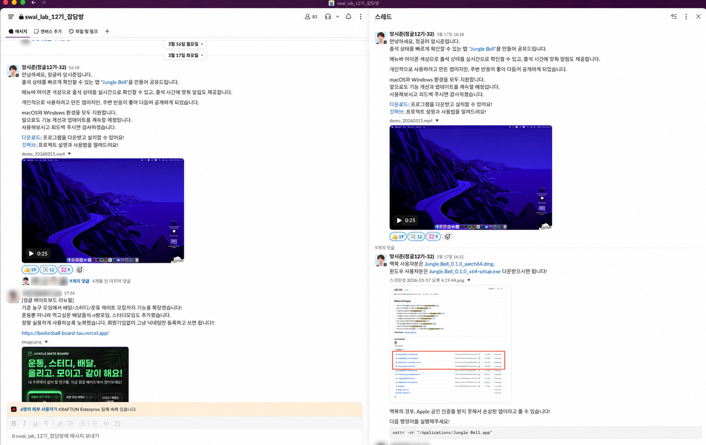
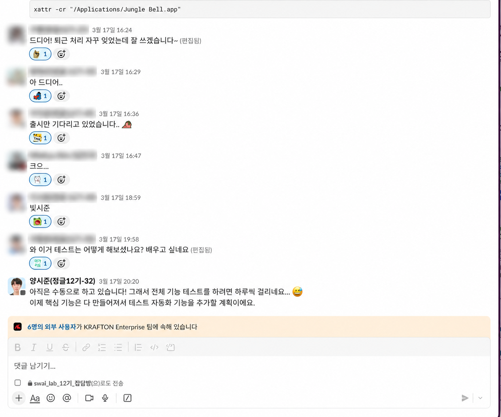
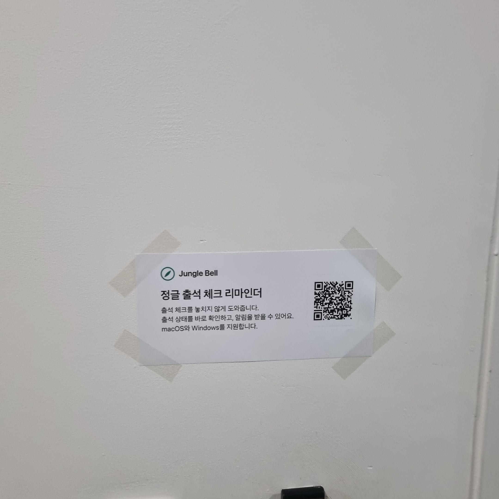
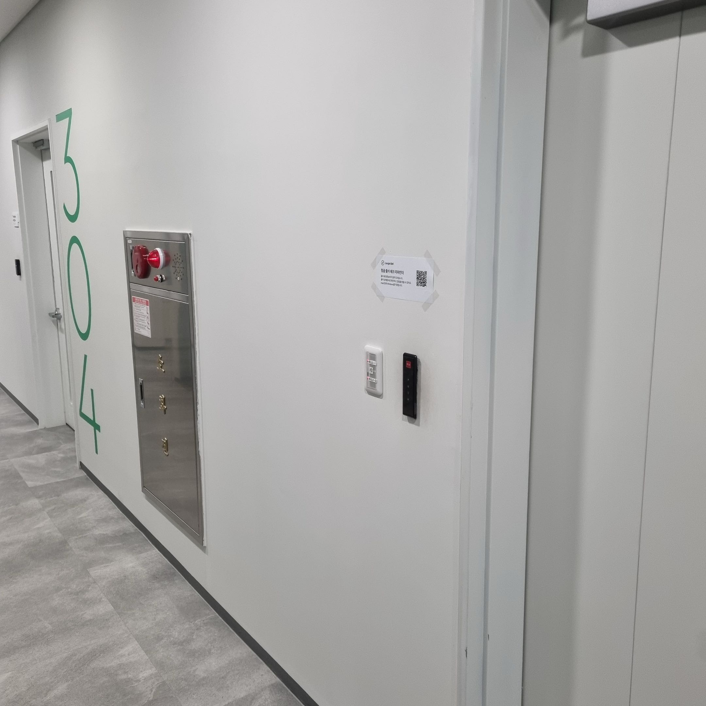
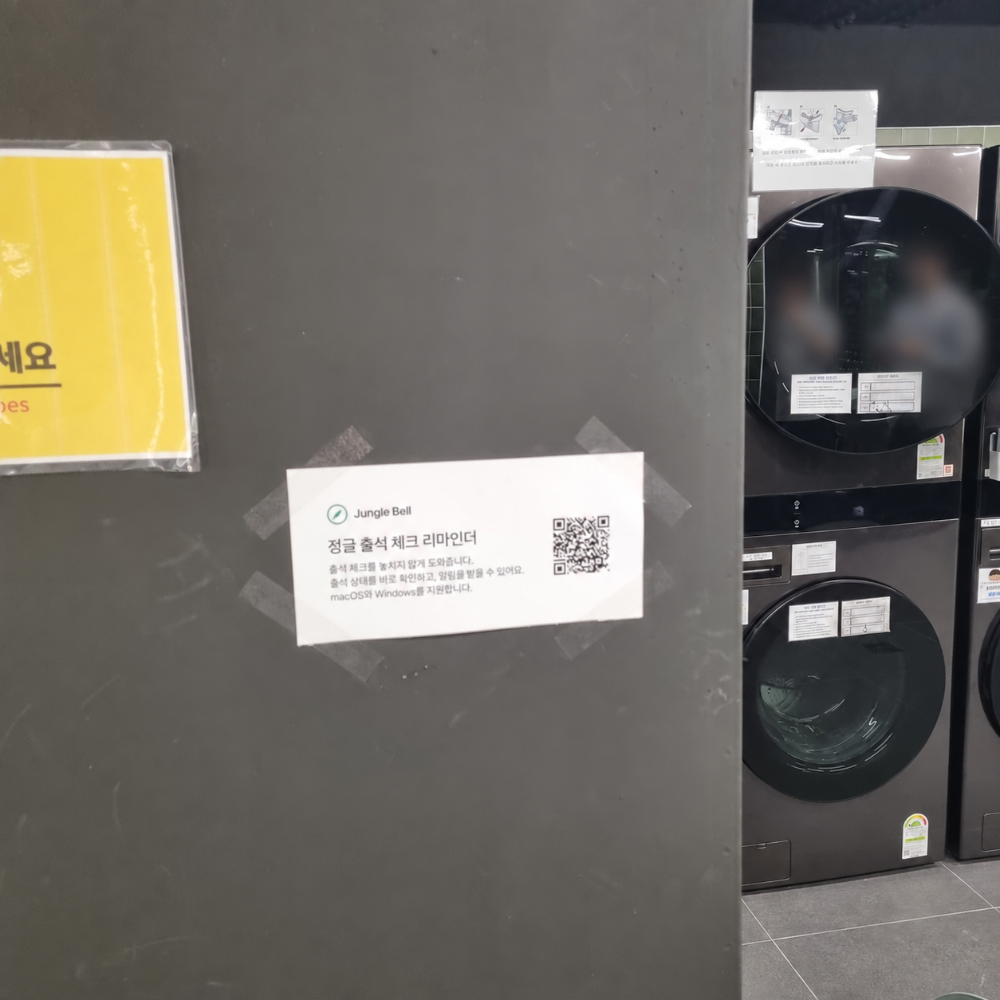
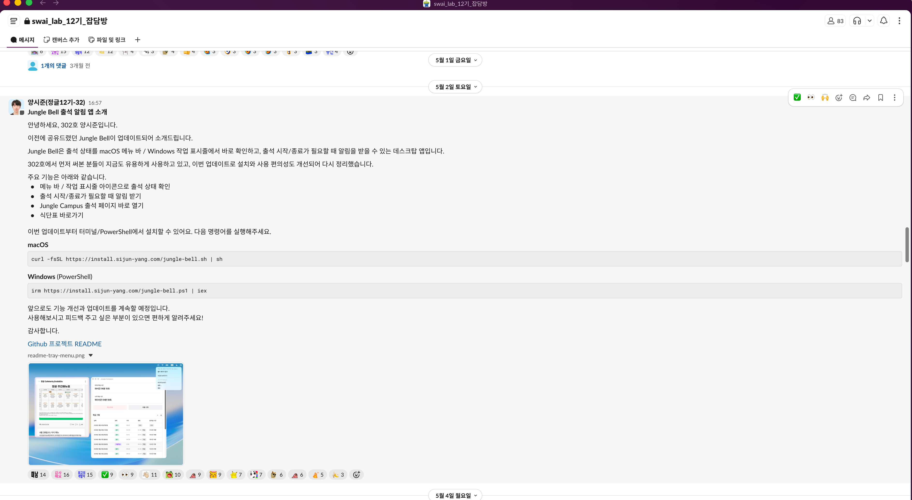
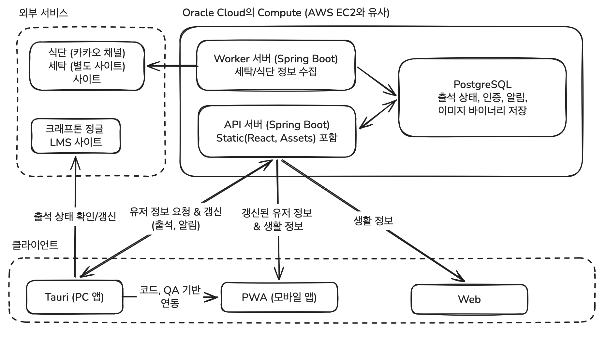
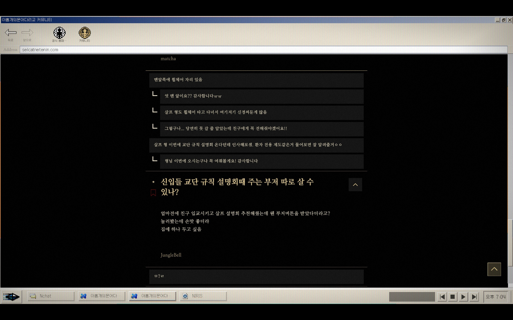

# Jungle Bell 개발기

Jungle Bell 개발하면서 했던 고민들이나 배경을 자유롭게 풀어 써봤습니다.

Jungle Bell이나 혹은 이런 사이드 프로젝트가 어떤 식으로 변하는지에 한 번 읽어보셔도 좋을 것 같습니다. 쭉 정리하다 보니 처음 정글 들어왔을 때 생각도 나고 재밌었네요.

## 글을 쓰게 된 이유

v1 당시에 가입자가 40명이었는데 이제는 v2로 리뉴얼했고 사용자들도 많이 바뀌었는데 40명을 넘었다. 웹 사용자까지 하면 더 많을 수도 있고...

최근 휴대폰을 바꾸면서 자료가 많이 버려지기도 했고, 프로젝트를 중단하게 되면 기억도 점점 희미해질 것 같아 이걸 계기로 과정을 기록해 두려고 한다.

## 탄생

크래프톤 정글에 있는 동안 LMS(Learning Management System)에 수동으로 출석 체크를 했어야 했는데, 매번 사이트를 열어야 했다.

특히 내가 했는지 안 했는지를 모르니까 매일 확인을 여러 번 해야 했다, 그러다 생각한 게 '이거 알림으로 받을 수 없나? 그렇다고 출석 자체를 자동화하는 건 좀 그렇고... 일단 내가 했는지 안 했는지만 알 수 있으면 좋겠다'는 생각이었다.

LMS 사이트의 네트워크 기록을 뜯어보니 JWT를 쿠키에 담아서 인증을 처리하고 있었다. 그러면 로그인한 상태를 이용해서 출석 상태만 가져오면 되지 않을까?

처음에는 브라우저 익스텐션을 생각했는데, 그러면 브라우저가 켜져 있어야 하기 때문에 결국에 신경 쓰는 건 마찬가지일 거 같더라. 그리고 알림을 받고 싶다고는 했지만, 팝업이 계속 뜨는 건 별로라고 생각해서, 좀 조용하게 내가 원하는 바로 알 수 있는 방법을 원했다.

그때 맥 메뉴 바에 있는 트레이 아이콘으로 알려주면 좋겠다는 생각을 했다. 카카오톡이나 다른 앱처럼 색만 바뀌어도 출석 상태를 바로 확인할 수 있을 것 같았다.

문제는 이걸 기술적으로 구현이 가능한가? 내가 로그인한 정보를 계속 들고 있을 수 있을까? JWT 토큰이 만료될 때마다 확인해야 하나?
그러다 든 생각이 브라우저 엔진에 LMS 페이지를 띄워두고, 그 페이지를 Playwright 같은 도구로 조작하면 일반 사용자처럼 토큰 갱신과 데이터 확인이 가능할 것 같았다.

Playwright를 쓰는 것보단 어차피 트레이를 사용하는 데스크톱 프로그램으로 만들 거라면 웹뷰 기반의 프레임워크를 사용할 수 있을 것 같았고

이러한 가설(브라우저 조작해서 인증 상태 유지, 웹뷰 프레임워크로 트레이 앱)이 맞는지 당시의 최근 모델인 GPT-5.4를 사용해서 확인했고 가능하다는 것을 확인한 후 프로젝트를 만들게 되었다.

## 일단 만들기

일렉트론을 고려했지만 일렉트론은 프로그램마다 크로미움 기반의 웹뷰를 내장해서 작은 기능을 돌리기에는 메모리를 너무 많이 쓰기에 마음에 들지 않았다. 그러다 예전에 봤던 Tauri를 적용해 보기로 했다. (해커뉴스에서 요즘 데스크톱 앱은 죄다 웹뷰에 너무 무겁다는 글을 보다가, 댓글에서 Rust 기반인 Tauri를 소개해서 알게 되었다.)

찾아보니 괜찮아 보였다. 그러면 AI로 일단 딸깍해 보니 생각보다 잘 됐다. 실행할 때 메모리를 얼마나 썼더라...? 17 MB 정도였던 거 같다. 아무튼 계속 켜두고 쓰기에 부담스럽지 않았다. 원하던 대로 트레이에서 출석 상태도 확인 가능했다.

  

## 출시

주변에 소개를 했는데 반응이 생각보다 좋았고, 사용할 수 있게 출시해 달라는 이야기를 들었다.

당시 OpenAI에서 와서 진행했던 워크숍 같은 행사가 있었는데, 그 무렵 내부에서 만든 토이 프로젝트를 공개하는 사람도 한두 명 있던 상황이라 홍보를 해도 뜬금없게 보이진 않을 거 같았기에.

AI가 만든 코드도 보고 아키텍처도 개선하고, 윈도우 사용하는 분한테 테스트도 요청하면서, 어느 정도 완성되었다 싶어 슬랙에도 소개 글과 설치 안내를 올렸다.

<table width="100%">
  <tr>
    <td width="57%" align="center" valign="top">
      
    </td>
    <td width="43%" align="center" valign="top">
      
    </td>
  </tr>
</table>

특히 사용자 늘어나는 게 즐거워서 주변 사람들한테 설치를 도와주기도 하고, 안내하면서 사용자의 행동을 지켜보기도 했는데, 깃헙 릴리스를 사용하는 게 생각보다 다들 어려워하더라.

본인의 운영체제나 환경에 맞는 확장자를 고르는 걸 어려워할 수 있다는 걸 생각을 못했다.
나는 그런 오픈소스나 공개된 프로젝트 버전 깔아서 설치해 본 경험이 많아서 그랬지만, 다른 사람들은 어려울 수 있겠다 싶었음.

(당시에는 문구를 개선하는 걸로 끝났지만, 이후에 설치 스크립트를 만들어서 개선했다.)

## 홍보

그렇게 한동안 쓰다가, 좀 더 제대로 사용자를 받아보고 싶어졌다.

슬랙에는 SW-AI Lab 코스 사람들만 보낼 수 있으니, 다른 코스 사람들도 올릴 수 있게 다른 것도 해보자 싶어서 홍보물을 뽑았다.

(또, 같은 반 분들의 도움으로 지인을 활용해서 게임랩, 테크랩 채널에 홍보 글 올리기도 했는데, 여기서 실명을 언급할 수는 없지만 이 기회에 감사하다는 말을 하고 싶다.)

  

사람들이 많이 지나다니는 곳에 직접 붙이고 다녔다. 층별 복도, 세탁실, 흡연실(오래 대기하고 있으니 특별히 2장) 등등

<table width="100%">
  <tr>
    <td width="33%" align="center">
      
    </td>
    <td width="33%" align="center">
      
    </td>
    <td width="33%" align="center">
      
    </td>
  </tr>
</table>

설치도 조금 더 쉽게 할 수 있도록 스크립트를 만들었다. 앱에서 GitHub로 피드백을 보낼 수 있게 하고(슬랙, 이메일로도 보낼 수 있게 했었다), 실제로 얼마나 쓰는지 궁금해서 분석용 통계도 수집하기 시작했다.

슬랙에 홍보도 했다.

  

이렇게 정글벨과 관련해서 가장 큰 홍보를 했는데, 결과가 아주 좋지는 않았다. 예비 사용자들도 정글 생활에 익숙해진지라 크게 사용하려고 하지 않더라, 그래서 아쉽게도 유저가 많이 늘어나진 않았음. (이때 아마 25명이었다가 v1 마지막 즈음 40명이 되었으니 15명 정도 늘었다.)

그래도 이런저런 기능 의견도 들어왔는데, 의견을 받아 기능을 추가하고 버그를 수정하는 등의 작업을 했다. 깃헙으로 실제 유저랑 소통해 본 경험도 처음이어서 신기했다. 내가 전혀 접점이 없는 다른 코스인 게임랩 분이 피드백 남겨준 것도 신기했음. (물론 내부에서만 쓰는 앱이지만)

이때 크게 세탁 정보 확인, 급식 알림 기능이 추가되어 종합 생활 앱으로 콘셉트를 바꾸었다.

다만 종종 나왔던 의견이지만, 커뮤니티 같은 걸 만드는 건 확실하게 별로라고 생각하고 추가하지 않았다. 이런 유형의 프로젝트에는 사용자가 항상 소비자로 남아 있어야 한다고 생각하기 때문인데, 커뮤니티나 리뷰, 평가 서비스처럼 사용자가 뭔가를 계속 생산해야 유지되는 서비스는 운영하기도 어렵고, 트래픽을 유지하기 어렵기 때문이다.

## v2 만들기, PWA와 인증 문제

정글 최종 프로젝트인 나만무와 그 준비로 바쁜 관계로 버그 수정 정도만 했었지만, 심화학습에 참여하기로 하면서 잉여 시간이 좀 생겼다.

그때 v2로 리뉴얼하면서 서버도 만들기 시작했다.

폰에서도 알림을 받으면 좋겠다는 생각은 기존에도 했지만 있었다. iOS와 안드로이드 앱은 심사, 출시 비용이 만만치 않아 고려하지 않았다.

그런데 당시 해커스펍을 사용하고, PWA를 쓰면서 웹앱도 폰에 설치하고 푸시 알림을 받을 수 있다는 걸 알게 됐다.

그러면 그냥 PWA로 해도 폰에서 알림을 받는다는 목적은 충분히 달성할 수 있을 것 같았다.

그렇다고 하면 인증 문제가 있는데, 나는 이런 사이드 플젝에서 보안, 관리 때문에 개인정보를 들고 있는 걸 좋아하지 않기 때문에, 처음에는 별도의 내 인증을 사용하지 않고, LMS 식별값을 해시해서 사용하려 했다. 그런데 해시를 해도 LMS에서 나온 값이라는 점은 같아서, 이후에는 AI가 제안한 설치별 랜덤 식별값으로 바꿔서 사용하게 됨. (PC 앱을 설치하면 랜덤하게 정해진다.)

LMS 로그인과 출석 확인은 PC 웹뷰에서 처리하고, 정글벨 서버 인증은 별도로 발급한 토큰을 사용하고 있다. (그래서 악의적인(?) 사용자가 LMS에 로그인하지 않고 정글벨 인증만 받을 수는 있다. 다만 그게 무슨 의미가 있을까... 싶어서 내버려두었다.)

폰에서는 이미 인증된 PC를 바탕으로 연결하도록 했다. PC에서 임시 코드를 발급하고 폰에서 입력하는 방식으로, 편의를 위해 QR 코드로도 가능하다.
이런 인증을 사용하는 이유는 결국 출석 정보를 가지는 유효한 유저는 LMS에 인증되어 있어야 하는데, 그 정보는 PC에만 들고 있고 서버에선 관리하고 있지 않기 때문이다.
그래서 PC가 인증의 메인이고, 사실상 PC 정보를 원격으로 받아본다는 느낌이기에 이렇게 개발했다. 그래서 PC에서 연결된 폰들을 확인하고 제거할 수도 있다.

그리고 폰이나 웹에서도 상태를 가지게 할 수 있기 위해서는 핵심 기능들을 서버로 옮겼지만, 출석 기능은 별도의 방법이 없었기에 PC에 남겨두었다. (사실 서버에서 출석을 처리하는 것도 고려하긴 했다. 병렬로 브라우저를 돌리고 갱신하는 식으로, 편하긴 하지만 JWT 정보를 옮겨서 관리하게 된다는 점, 서비스 사용 조항을 어길 수 있다는 점 등이 너무 위험한 거 같아 결국 채택하지 않았다.)

## v2 서버 옮기기

초반 기술 스택은 Hono 기반의 Cloudflare Workers를 사용했다. 그런데 cron으로 식사 정보를 긁어오는 작업이 1분 넘게 걸리면서 비정상적으로 종료되는 문제가 생겼다.
성공률이 높으면 모르겠는데 거의 대부분의 경우에서 실패했다, 처음에는 그 작업만 따로 돌리려고 오라클 클라우드(OCI)에 가입해서 프리티어 컴퓨팅 자원으로 돌렸다.

그렇게 필요한 부분만 옮겨서 쓰다가 보니, 너무 파편화된 거 같아 결국 서버를 익숙한 Spring Boot 기반으로 변경하고 오라클 Compute(AWS의 EC2와 비슷) 하나에 Docker 환경에서 돌아가게 합치기로 했다.

Cloudflare D1, R2 환경도 이관하고, API 서버와 수집 작업, DB를 한 컴퓨터에서 운영하는 구조로 변경했다.

  

현재는 위 그림처럼 OCI(Oracle Cloud Infrastructure)의 컴퓨팅 자원 하나 안에서 처리하고 있다. 프리티어 컴퓨팅 자원 제한이 최근에 절반으로 줄었지만, 그래도 넉넉하다 보니 충분히 무리 없이 처리하고 있다. (지금 서비스 규모를 생각하면 고스펙이다, 하나 아쉬운점은 처음 OCI의 프리티어 대상 리전을 자리 많다는 싱가폴로 선택해서, 싱가폴에 서버가 있다보니 물리적 거리가 있어서 뭘 해도 100ms 이상의 레이턴시를 보여준다...)

웹 화면에 필요한 정적 파일과 식단 이미지를 서버에서 내려주지만, 같은 공개 에셋은 사용자마다 달라지는 내용이 없어서 캐시를 적극적으로 활용하니 크게 속도 문제를 느끼지 않고 있다.

## 현황

SW-AI Lab 13기 분들이 들어오고 나선 크게 홍보하지 않았는데, 어느새 다시 많은 사용자가 사용하고 있다. 필요한 기능은 이제 거의 다 만든 것 같아서, 당분간 기능을 크게 추가할 생각은 없지만 관리는 꾸준히 하는 중이다.

다만 심화학습 기간도 어느덧 절반을 바라보고 있다. 가능하면 이후에도 누군가 유지보수해 주면 좋겠지만, 현실적으로는 쉽지 않을 것 같다...

## 여담

#### 1. 이스터에그 출현

크래프톤 게임랩 3기에서 출시해서 좋은 반응을 얻은 '노 리절트 파운드'라는 게임에 이스터에그(?)로 숨어 있기도 했다... 게임 속 커뮤니티에 JungleBell이라는 사용자 이름으로 나온다. 꽤나 신기한 경험이었다.

  

[무려 침착맨!! 도 한 게임이다](https://youtu.be/ZUi1xgBKDPE?t=2271)

#### 2. 포크 및 기능 확장

최근에는 좀 신기한 일도 있었다. 누군가 이 프로젝트를 포크해서 기능을 확장하고, 안드로이드용 위젯을 만들었더라. 이렇게 포크해서 관리하는 걸 보기만 했지 내가 만든 걸 누군가 포크해서 가져다 쓰는 건 처음이다.

앞으로도 오픈소스 활동을 하고 프로젝트를 만들다 보면, 이런 일이 더 생기지 않을까 싶다.
